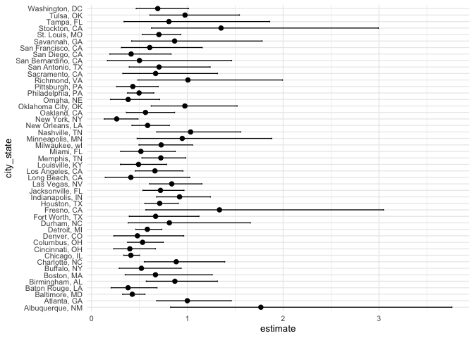

p8105_hw6_yz5248
================
yz5248
2025-11-15

# Problem 1

``` r
homicides_df = read_csv("homicide-data.csv")
```

    ## Rows: 52179 Columns: 12
    ## ── Column specification ────────────────────────────────────────────────────────
    ## Delimiter: ","
    ## chr (9): uid, victim_last, victim_first, victim_race, victim_age, victim_sex...
    ## dbl (3): reported_date, lat, lon
    ## 
    ## ℹ Use `spec()` to retrieve the full column specification for this data.
    ## ℹ Specify the column types or set `show_col_types = FALSE` to quiet this message.

## cleaning the data

``` r
clean_df =
  homicides_df |>
  mutate(
    city_state = str_c(city, ", ", state),
    solved = if_else(
      disposition == "Closed by arrest", 1, 0
    ),
    victim_age = as.numeric(victim_age)
  ) |>
  filter(!city_state %in% c(
    "Dallas, TX", "Phoenix, AZ", "Kansas City, MO", "Tulsa, AL"
  )) |>
  filter(victim_race %in% c("Black", "White")) |>
  filter(victim_sex %in% c("Male", "Female")) |>
  mutate(
    victim_sex = as.factor(victim_sex)
  )|>
  drop_na(victim_age, victim_sex, victim_race)
```

    ## Warning: There was 1 warning in `mutate()`.
    ## ℹ In argument: `victim_age = as.numeric(victim_age)`.
    ## Caused by warning:
    ## ! NAs introduced by coercion

## fitting GLM function

``` r
baltimore_df =
  clean_df |>
  filter(city_state == "Baltimore, MD")

baltimore_fit =
  glm(
    solved ~ victim_age + victim_sex + victim_race,
    data = baltimore_df,
    family = binomial()
  )

baltimore_results =
  baltimore_fit |>
  broom::tidy(conf.int = TRUE, exponentiate = TRUE)

baltimore_results
```

    ## # A tibble: 4 × 7
    ##   term             estimate std.error statistic  p.value conf.low conf.high
    ##   <chr>               <dbl>     <dbl>     <dbl>    <dbl>    <dbl>     <dbl>
    ## 1 (Intercept)         1.36    0.171        1.81 7.04e- 2    0.976     1.91 
    ## 2 victim_age          0.993   0.00332     -2.02 4.30e- 2    0.987     1.00 
    ## 3 victim_sexMale      0.426   0.138       -6.18 6.26e-10    0.324     0.558
    ## 4 victim_raceWhite    2.32    0.175        4.82 1.45e- 6    1.65      3.28

``` r
baltimore_OR_male =
  baltimore_results |>
  filter(term == "victim_sexMale") |>
  select(term, estimate, conf.low, conf.high)

baltimore_OR_male
```

    ## # A tibble: 1 × 4
    ##   term           estimate conf.low conf.high
    ##   <chr>             <dbl>    <dbl>     <dbl>
    ## 1 victim_sexMale    0.426    0.324     0.558

## running for whole dataset

``` r
nested_df =
  clean_df |>
  group_by(city_state) |>
  nest()

results_df =
  nested_df |>
  mutate(
    fit = map(data, ~ glm(
      solved ~ victim_age + victim_sex + victim_race,
      data = .x,
      family = binomial()
    )),
    
    tidy_fit = map(fit, ~ tidy(
      .x,
      conf.int = TRUE,
      exponentiate = TRUE
    ))
  ) |>
  unnest(tidy_fit) |>
  filter(term == "victim_sexMale") |>
  select(
    city_state, estimate, conf.low, conf.high
  )
results_df
```

    ## # A tibble: 47 × 4
    ## # Groups:   city_state [47]
    ##    city_state      estimate conf.low conf.high
    ##    <chr>              <dbl>    <dbl>     <dbl>
    ##  1 Albuquerque, NM    1.77     0.825     3.76 
    ##  2 Atlanta, GA        1.00     0.680     1.46 
    ##  3 Baltimore, MD      0.426    0.324     0.558
    ##  4 Baton Rouge, LA    0.381    0.204     0.684
    ##  5 Birmingham, AL     0.870    0.571     1.31 
    ##  6 Boston, MA         0.667    0.351     1.26 
    ##  7 Buffalo, NY        0.521    0.288     0.936
    ##  8 Charlotte, NC      0.884    0.551     1.39 
    ##  9 Chicago, IL        0.410    0.336     0.501
    ## 10 Cincinnati, OH     0.400    0.231     0.667
    ## # ℹ 37 more rows

## plotting the result

``` r
results_plot =
  results_df |>
  arrange(estimate) |>   
  mutate(city_state = factor(city_state, levels = city_state)) |>
  ggplot(aes(x = city_state, y = estimate)) +
  geom_point(size = 2) +
  geom_errorbar(aes(ymin = conf.low, ymax = conf.high), width = 0.2) +
  coord_flip() +
  theme_minimal(base_size = 10)

results_plot
```

<!-- -->
