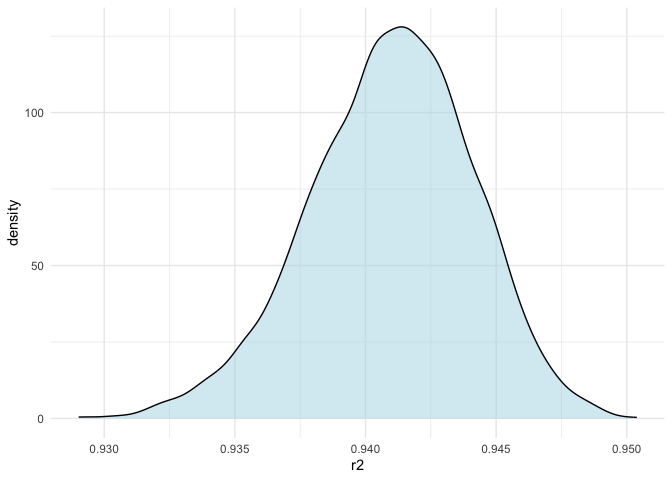
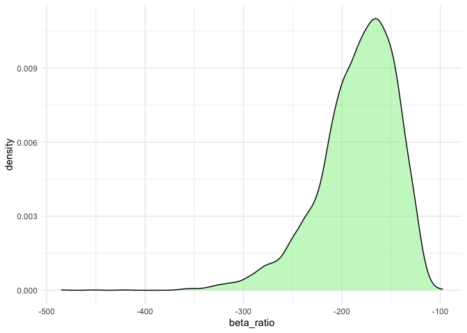
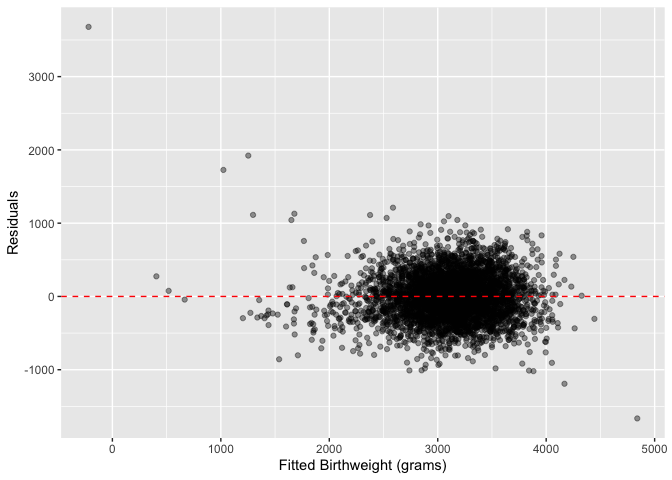

p8105_hw6_yz5248
================
yz5248
2025-11-15

# Problem 1

``` r
homicides_df = read_csv("homicide-data.csv")
```

    ## Rows: 52179 Columns: 12
    ## ── Column specification ────────────────────────────────────────────────────────
    ## Delimiter: ","
    ## chr (9): uid, victim_last, victim_first, victim_race, victim_age, victim_sex...
    ## dbl (3): reported_date, lat, lon
    ## 
    ## ℹ Use `spec()` to retrieve the full column specification for this data.
    ## ℹ Specify the column types or set `show_col_types = FALSE` to quiet this message.

## cleaning the data

``` r
clean_df =
  homicides_df |>
  mutate(
    city_state = str_c(city, ", ", state),
    solved = if_else(
      disposition == "Closed by arrest", 1, 0
    ),
    victim_age = as.numeric(victim_age)
  ) |>
  filter(!city_state %in% c(
    "Dallas, TX", "Phoenix, AZ", "Kansas City, MO", "Tulsa, AL"
  )) |>
  filter(victim_race %in% c("Black", "White")) |>
  filter(victim_sex %in% c("Male", "Female")) |>
  mutate(
    victim_sex = as.factor(victim_sex)
  )|>
  drop_na(victim_age, victim_sex, victim_race)
```

    ## Warning: There was 1 warning in `mutate()`.
    ## ℹ In argument: `victim_age = as.numeric(victim_age)`.
    ## Caused by warning:
    ## ! NAs introduced by coercion

## fitting GLM function

``` r
baltimore_df =
  clean_df |>
  filter(city_state == "Baltimore, MD")

baltimore_fit =
  glm(
    solved ~ victim_age + victim_sex + victim_race,
    data = baltimore_df,
    family = binomial()
  )

baltimore_results =
  baltimore_fit |>
  broom::tidy(conf.int = TRUE, exponentiate = TRUE)

baltimore_results
```

    ## # A tibble: 4 × 7
    ##   term             estimate std.error statistic  p.value conf.low conf.high
    ##   <chr>               <dbl>     <dbl>     <dbl>    <dbl>    <dbl>     <dbl>
    ## 1 (Intercept)         1.36    0.171        1.81 7.04e- 2    0.976     1.91 
    ## 2 victim_age          0.993   0.00332     -2.02 4.30e- 2    0.987     1.00 
    ## 3 victim_sexMale      0.426   0.138       -6.18 6.26e-10    0.324     0.558
    ## 4 victim_raceWhite    2.32    0.175        4.82 1.45e- 6    1.65      3.28

``` r
baltimore_OR_male =
  baltimore_results |>
  filter(term == "victim_sexMale") |>
  select(term, estimate, conf.low, conf.high)

baltimore_OR_male
```

    ## # A tibble: 1 × 4
    ##   term           estimate conf.low conf.high
    ##   <chr>             <dbl>    <dbl>     <dbl>
    ## 1 victim_sexMale    0.426    0.324     0.558

## running for whole dataset

``` r
nested_df =
  clean_df |>
  group_by(city_state) |>
  nest()

results_df =
  nested_df |>
  mutate(
    fit = map(data, ~ glm(
      solved ~ victim_age + victim_sex + victim_race,
      data = .x,
      family = binomial()
    )),
    
    tidy_fit = map(fit, ~ tidy(
      .x,
      conf.int = TRUE,
      exponentiate = TRUE
    ))
  ) |>
  unnest(tidy_fit) |>
  filter(term == "victim_sexMale") |>
  select(
    city_state, estimate, conf.low, conf.high
  )
results_df
```

    ## # A tibble: 47 × 4
    ## # Groups:   city_state [47]
    ##    city_state      estimate conf.low conf.high
    ##    <chr>              <dbl>    <dbl>     <dbl>
    ##  1 Albuquerque, NM    1.77     0.825     3.76 
    ##  2 Atlanta, GA        1.00     0.680     1.46 
    ##  3 Baltimore, MD      0.426    0.324     0.558
    ##  4 Baton Rouge, LA    0.381    0.204     0.684
    ##  5 Birmingham, AL     0.870    0.571     1.31 
    ##  6 Boston, MA         0.667    0.351     1.26 
    ##  7 Buffalo, NY        0.521    0.288     0.936
    ##  8 Charlotte, NC      0.884    0.551     1.39 
    ##  9 Chicago, IL        0.410    0.336     0.501
    ## 10 Cincinnati, OH     0.400    0.231     0.667
    ## # ℹ 37 more rows

## plotting the result

``` r
results_plot =
  results_df |>
  arrange(estimate) |>   
  mutate(city_state = factor(city_state, levels = city_state)) |>
  ggplot(aes(x = city_state, y = estimate)) +
  geom_point(size = 2) +
  geom_errorbar(aes(ymin = conf.low, ymax = conf.high), width = 0.2) +
  coord_flip() +
  theme_minimal(base_size = 10)

results_plot
```

<!-- --> The
plot shows substantial variation across cities in the adjusted odds
ratio for solving homicides involving male victims compared with female
victims. In most cities, the estimated ORs are close to 1, and many
confidence intervals include 1, suggesting little evidence of a strong
gender difference in clearance rates after adjusting for age and race.
However, several cities show ORs below 1, indicating lower clearance
rates for male victims relative to female victims, while a few cities
show ORs above 1. The wide confidence intervals seen in some
cities—particularly those with smaller numbers of homicide
cases—indicate substantial uncertainty in the estimated effects.
Overall, the association between victim sex and homicide resolution
varies by city, with no consistent pattern across locations.

# Problem 2

``` r
library(p8105.datasets)
data("weather_df")
```

## generate the function

``` r
bootstrap_est = function(df) {
  
  fit = lm(tmax ~ tmin + prcp, data = df)
  
  r2 = glance(fit)$r.squared
  
  coef_info = tidy(fit)
  beta1 = coef_info$estimate[coef_info$term == "tmin"]
  beta2 = coef_info$estimate[coef_info$term == "prcp"]
  
  tibble(
    r2 = r2,
    beta_ratio = beta1 / beta2
  )
}
```

## create a bootstrap framework

``` r
set.seed(100)  

bootstrap_results =
  tibble(i = 1:5000) |>
  mutate(
    boot_sample = map(i, ~ sample_n(weather_df, size = nrow(weather_df), replace = TRUE)),
    boot_est = map(boot_sample, bootstrap_est)
  ) |>
  select(-boot_sample) |>
  unnest(boot_est)
bootstrap_results
```

    ## # A tibble: 5,000 × 3
    ##        i    r2 beta_ratio
    ##    <int> <dbl>      <dbl>
    ##  1     1 0.945      -201.
    ##  2     2 0.938      -140.
    ##  3     3 0.939      -254.
    ##  4     4 0.945      -188.
    ##  5     5 0.939      -151.
    ##  6     6 0.943      -147.
    ##  7     7 0.943      -162.
    ##  8     8 0.936      -248.
    ##  9     9 0.943      -136.
    ## 10    10 0.947      -187.
    ## # ℹ 4,990 more rows

## plotting the R^2 distribution

``` r
dist_r2_plot =
  bootstrap_results |>
  ggplot(aes(x = r2)) +
  geom_density(fill = "lightblue", alpha = 0.5) +
  theme_minimal()
dist_r2_plot
```

<!-- -->
The bootstrap distribution of $r^2$ is approximately symmetric and
concentrated around a value near 0.94. This indicates that the linear
model explains a consistently large proportion of the variability in
‘tmax’ across bootstrap samples. The distribution is fairly narrow,
suggesting that $r^2$ is estimated with relatively low uncertainty and
is stable across repeated resampling of the data.

## plotting the beta_ratio distribution

``` r
dist_ratio_plot =
  bootstrap_results |>
  ggplot(aes(x = beta_ratio)) +
  geom_density(fill = "lightgreen", alpha = 0.5) +
  theme_minimal()
dist_ratio_plot
```

<!-- -->
The bootstrap distribution of the coefficient ratio $β₁ / β₂$ is much
more variable and strongly skewed. The distribution spreads widely, with
values ranging from roughly –500 to –100 and a long left tail. This
reflects substantial instability in the ratio, largely because $β₂$ is
small and close to 0 in many samples, making the ratio highly sensitive
to small changes in $β₂$.

## R^2 95% Confidence Interval

``` r
CI_R2 =
  bootstrap_results$r2 |>
  quantile(probs = c(0.025, 0.975))
CI_R2
```

    ##      2.5%     97.5% 
    ## 0.9343259 0.9466045

The 95% confidence interval for $r^2$ is \[0.9343259 0.9466045\]

## Beta_ratio 95% Confidence Interval

``` r
CI_ratio =
  bootstrap_results$beta_ratio |>
  quantile(probs = c(0.025, 0.975))
CI_ratio
```

    ##      2.5%     97.5% 
    ## -280.5287 -125.6147

The 95% confidence interval for $β₁ / β₂$ is \[-280.5287 -125.6147\]

# Problem 3

``` r
birthweight_df = 
  read_csv("birthweight.csv") |>
  janitor::clean_names() 
```

    ## Rows: 4342 Columns: 20
    ## ── Column specification ────────────────────────────────────────────────────────
    ## Delimiter: ","
    ## dbl (20): babysex, bhead, blength, bwt, delwt, fincome, frace, gaweeks, malf...
    ## 
    ## ℹ Use `spec()` to retrieve the full column specification for this data.
    ## ℹ Specify the column types or set `show_col_types = FALSE` to quiet this message.

## convert numeric variable to factor

``` r
birthweight_df = 
  birthweight_df |> 
  mutate(
    babysex = factor(
      babysex, 
      levels = c(1, 2), 
      labels = c("male", "female")
    ),
    malform = factor(
      malform, 
      levels = c(0, 1),
      labels = c("absent", "present")
    ),
    frace = factor(frace),
    mrace = factor(mrace)
  )
```

## Check missing data

``` r
missing_summary =
  birthweight_df |> 
  summarise(across(everything(), ~ sum(is.na(.x)))) |> 
  pivot_longer(everything(),
               names_to = "variable",
               values_to = "missing_n") 

print(missing_summary)
```

    ## # A tibble: 20 × 2
    ##    variable missing_n
    ##    <chr>        <int>
    ##  1 babysex          0
    ##  2 bhead            0
    ##  3 blength          0
    ##  4 bwt              0
    ##  5 delwt            0
    ##  6 fincome          0
    ##  7 frace            0
    ##  8 gaweeks          0
    ##  9 malform          0
    ## 10 menarche         0
    ## 11 mheight          0
    ## 12 momage           0
    ## 13 mrace            0
    ## 14 parity           0
    ## 15 pnumlbw          0
    ## 16 pnumsga          0
    ## 17 ppbmi            0
    ## 18 ppwt             0
    ## 19 smoken           0
    ## 20 wtgain           0

## Fit model 1

``` r
mod1 = lm(
  bwt ~ gaweeks + blength + babysex + mheight + ppbmi + wtgain + smoken + momage + mrace, data = birthweight_df
)

summary(mod1)
```

    ## 
    ## Call:
    ## lm(formula = bwt ~ gaweeks + blength + babysex + mheight + ppbmi + 
    ##     wtgain + smoken + momage + mrace, data = birthweight_df)
    ## 
    ## Residuals:
    ##     Min      1Q  Median      3Q     Max 
    ## -1664.8  -205.8    -5.2   200.3  3678.7 
    ## 
    ## Coefficients:
    ##                 Estimate Std. Error t value Pr(>|t|)    
    ## (Intercept)   -4743.4339   149.1484 -31.803  < 2e-16 ***
    ## gaweeks          22.6653     1.6508  13.730  < 2e-16 ***
    ## blength         115.0809     1.9847  57.983  < 2e-16 ***
    ## babysexfemale   -20.0028     9.6563  -2.071 0.038373 *  
    ## mheight          14.8371     1.8993   7.812 7.01e-15 ***
    ## ppbmi            11.8684     1.5512   7.651 2.44e-14 ***
    ## wtgain            5.3819     0.4534  11.870  < 2e-16 ***
    ## smoken           -6.3690     0.6749  -9.437  < 2e-16 ***
    ## momage            2.0455     1.3499   1.515 0.129779    
    ## mrace2         -177.8236    11.2014 -15.875  < 2e-16 ***
    ## mrace3          -79.6852    49.2268  -1.619 0.105577    
    ## mrace4          -79.1976    22.1433  -3.577 0.000352 ***
    ## ---
    ## Signif. codes:  0 '***' 0.001 '**' 0.01 '*' 0.05 '.' 0.1 ' ' 1
    ## 
    ## Residual standard error: 314.7 on 4330 degrees of freedom
    ## Multiple R-squared:  0.6233, Adjusted R-squared:  0.6224 
    ## F-statistic: 651.4 on 11 and 4330 DF,  p-value: < 2.2e-16

I constructed my regression model using a combination of hypothesized
structure model and data-driven exploration. From a biological
perspective, birthweight is primarily determined by fetal size and
duration of gestation; thus I included gestational age, birth length,
and infant sex. Maternal anthropometrics (height, pre-pregnancy BMI) and
pregnancy weight gain reflect nutritional environment and were included
based on established literature.  
I then examined correlations and exploratory plots, identifying smoking
during pregnancy as strongly associated with reduced birthweight.
Maternal age and race also showed moderate associations and were added.
Interaction terms and higher-order polynomials were not included to
avoid unnecessary complexity, as supported by residual diagnostics.

``` r
resid_plot =
  birthweight_df |>
  add_predictions(mod1) |>
  add_residuals(mod1) |>
  ggplot(aes(x = pred, y = resid)) +
  geom_point(alpha = 0.4) +
  geom_hline(yintercept = 0, color = "red", linetype = "dashed") +
  labs(
    x = "Fitted Birthweight (grams)",
    y = "Residuals"
  )

resid_plot
```

<!-- --> -
Residuals are centered around zero across the entire fitted range. This
indicates that the model does not systematically over- or under-predict
birthweight at any particular level of fitted values. The horizontal
spread of points around the red dashed line (y = 0) supports the
assumption that the model’s mean structure is reasonably well specified.

- The point cloud does not display a pronounced U‐shape or inverted
  U‐shape. This suggests that the relationship between predictors and
  birthweight does not show obvious unmodeled nonlinearity. A linear
  model appears appropriate for capturing the main trends.

- Variability is roughly constant, though with mild heteroscedasticity：
  There is slightly greater spread of residuals at higher fitted
  birthweights (around 3000–4000 grams).

- A few extreme residuals appear, but they are rare.
